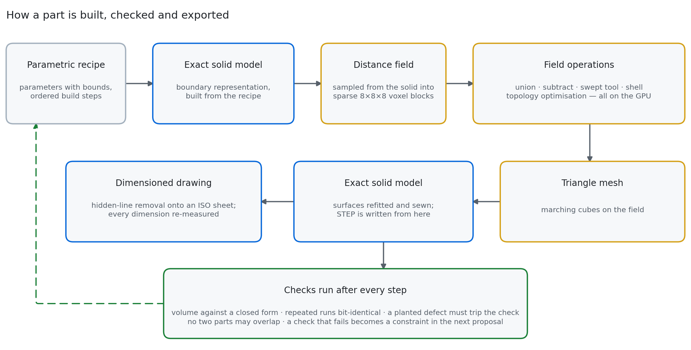
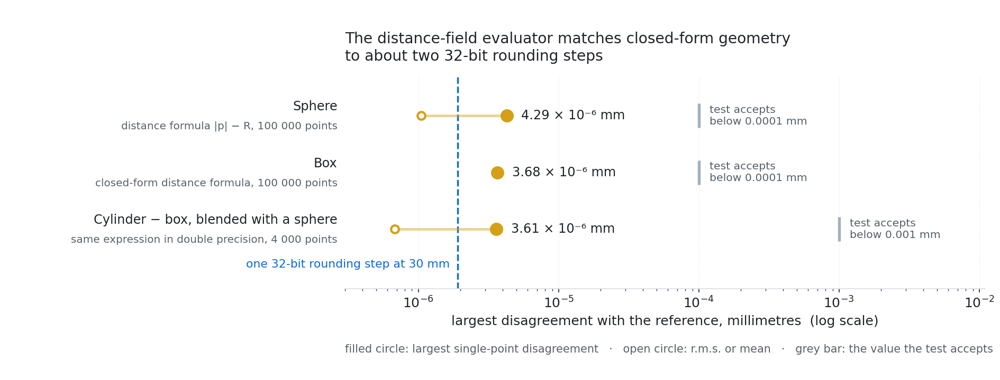

<picture>
  <source media="(prefers-color-scheme: dark)" srcset="docs/brand/banner-dark.png">
  
</picture>

> Part of 3FOLD · results are nodes in the [Decorrelation Graph Engine](https://github.com/antonbj3/3fold-graph-engine)

---

## What it is

Field Engine is a generative CAD engine built on a GPU-resident signed distance field, at an early stage. The representation is a block-sparse SDF of the NanoVDB and PicoGK class, evaluated and combined by min/max CSG in Warp kernels, with an exact B-rep kernel (OpenCascade) beside it for dimensions, STEP export and drawings. Generative operations run on the field: routing by Euclidean distance transform and geodesic front through a rasterised obstacle space; subtractive manufacturing as field operations, turning as morphological closing with the tool nose radius and milling and drilling as GPU kernels; route-topology proposal over the clearance field, judged by a lattice-Boltzmann flow simulation; density-based topology optimisation of load-bearing parts; keep-out volumes as typed rooms composed from machine level to hall level. It descends from IKARUS, an SDF expression tree compiled to fused Warp kernels.

The ambition: generative design over many variables with physics objectives, flow, stiffness, thermal; manufacturability as a property of the search space, by searching over blank and tool sequence rather than over shape; one placement optimisation from subassembly to factory hall, using the SDF as clearance and its gradient as the move direction; inputs from a requirement tree, a rough natural-language intent, or video of an existing object via a Gaussian splat.

<picture>
  <source media="(prefers-color-scheme: dark)" srcset="docs/fig8/cad-pipeline-dark.png">
  
</picture>

*The chain from requirement to part: recipe, search, field and exact solid, drawing, measurement.*

---

## How it works

**The kernel.** A block-sparse signed distance field on the GPU, of the same class as PicoGK and NanoVDB: the domain is split into blocks, each block is classified as inside, outside or on the surface from eight corner evaluations, and only surface blocks are stored. Shapes combine by min and max of their distance fields. Two known primitives combined this way match their closed form to within a few parts in a million.

<picture>
  <source media="(prefers-color-scheme: dark)" srcset="docs/fig8/field-accuracy-dark.png">
  
</picture>

*The field evaluator against closed-form sphere and box references over 100 000 points.*

**Growth.** The obstacles of a space are rasterised, an exact distance-to-nearest-obstacle field is computed, and a front is released from the source that travels fast where there is room and slowly where it is tight, and not at all below the required radius. The path it takes is the centreline of the duct.

**Cutting.** Turning is the morphological closing of the profile with the tool's nose radius, which is exactly what a tool of that radius can reach. Pocket milling and drilling are GPU kernels over the whole field. All three are one mechanism: the material field against the negative of the tool.

**Route topology.** Where a fixed route is structurally impossible, a route topology is proposed by sampling over the clearance field, descended, and judged by a flow simulation on the result. The line runs on the CPU on a synthetic plenum: growth by radius descent, topology proposal, and the lattice-Boltzmann pressure-drop judge.

**Material removal.** Density-based topology optimisation on the field: material is driven down under a stiffness constraint until only the load path is left.

**Keep-out.** A machine's service, media and cooling volumes are declared as rooms with a class, a source and an owner. The same composer lifts them one level up, so that a machine's rooms become the hall's rooms, and congestion is an outcome the layout reports rather than an error.

**Speed on the field.** Combining many primitives runs as tiled reads of the leaf boxes instead of gathering points: the result equals the full representation exactly, in 27.6 ms, 4.9 times faster than the point-gather fusion on the same input. A native CPU batch of the same operation is 1.9 to 2.4 times faster again, with the saved field equal byte for byte and the B-rep reference volume matched exactly. Native packing of the sparse blocks is 11.5 to 18.7 times faster than the reference with identical split decisions. Latency and throughput per field size are tabulated in `docs/BENCHMARKS.md`. Two accelerations did not reach their own gate and are recorded that way: the native distance transform misses its 2× target on one thin case, 4.84 ms against 5.03 ms, and the native tile reader on its own reaches 1.24× where 1.25× was required.

**Resolution where it is needed.** The pitch can vary per block, so that small features get fine blocks and flat regions coarse ones. On the test part the hole-volume error is 3.0 % with mixed pitch, against 2.9 % at the fine pitch everywhere and 5.1 % at the coarse.

**Back from the solid.** A feature recogniser on the exact solid classifies faces, chamfers and fillets included, so that a recipe can be rebuilt from a solid and compared with the one that made it; the reverse direction, field to recipe, closes on the two parts whose recipe is known.
---

## Layout, at every scale

Placing parts in a subassembly, machines in a hall and stations along a flow is one problem: bodies with footprints, clearances, reach and precedence, placed under constraints. Today it exists in pieces.

- **Parts.** Parameters and machining sequences are searched.
- **Assemblies.** Placements are written by rule from the recipe's parameters; a 235-part engine and a 117-part chassis are built that way. Interference is checked as an exact solid boolean over every close pair, and that check is what found the placement errors: 220 pairs sharing material in the first engine build, none after six rounds of repair. Assembly order is derived from geometry and from declared mates; on an 82-part projector master, 64 parts have no valid insertion path along six directions, so no order exists there yet.
- **Factories.** Stations are placed by simulated annealing against footprints, zones and flow: an 18-station hall, and a car factory of 11 stations laid out from its process sheet.

Nothing yet generates an assembly by searching over placements, which is the operation the factory tier already does for stations. That is the next connection.

---

## Where it goes

Search over process and requirement together, so that the requirement is shaped by what can be made and not only checked against it. Assemblies generated by the same search that places stations. Layout drawings generated from the process sequence, which is where a factory design starts. A change to an existing cell as input, alongside a specification, an intent, or video.

---

## The chain around it

The field engine is one organ in the generative CAD chain. The others run in the exact solid kernel and share the same requirement trees and the same record.

**Process space.** A part is built as a blank and an ordered sequence of machining operations, so that every candidate is manufacturable by construction: the inner corner gets the tool radius, a pocket exists only where the tool reaches, and the toolpath and its cost come for free. A requirement the tools cannot meet stops the search with the reason: an 8 mm pocket asked of a 12 mm cutter, a depth beyond the flute length, a corner tighter than the smallest tool.

**Recipes and the loop.** A part family is a recipe: parameters with bounds and an ordered build. The search proposes parameter values, builds and scores. In the generative loop a swing bracket went from 35.55 kg to 17.02 kg with its stiffness and first mode held, on a finer mesh than it was designed on.

**Assemblies and drawings.** A 235-part engine from a parametric specification, interference-free after repair; a whole car assembled from its systems is in progress. Every dimension on a generated drawing is measured again from the geometry by code that shares nothing with the generator: 30 dimensions on 4 sheets, largest disagreement 0.0045 mm. Rebuilding the engine's crank assembly cold takes 195 s; warm, from the part store, 4.2 s.
